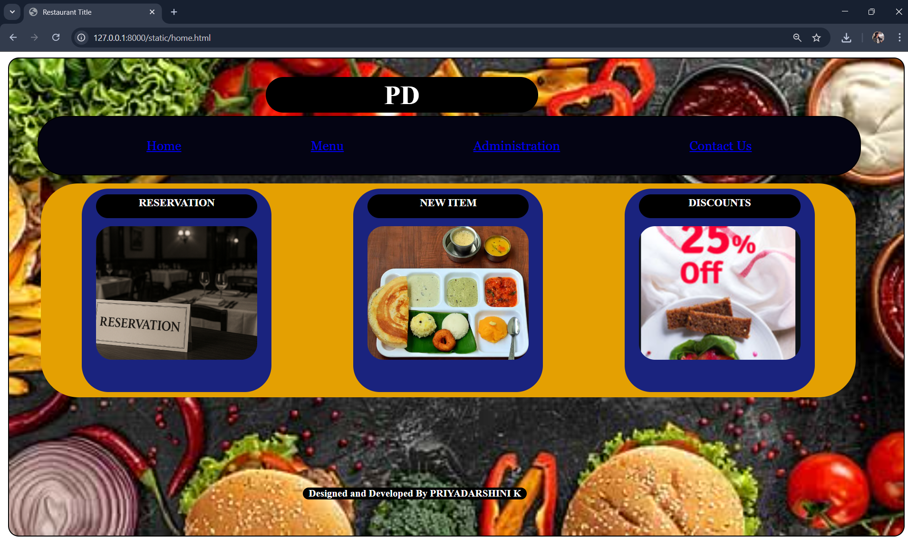
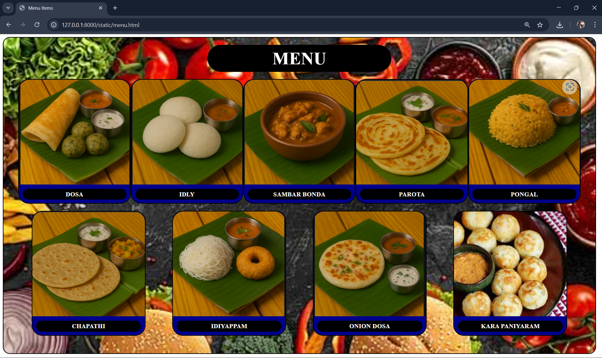
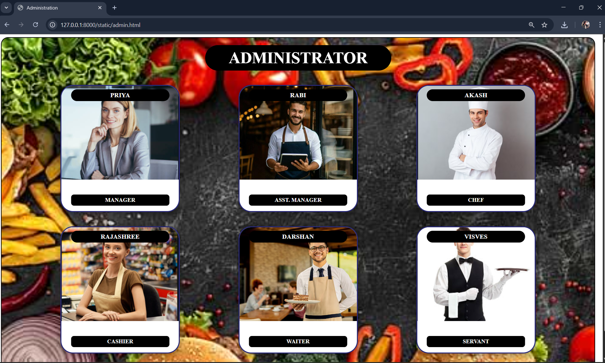
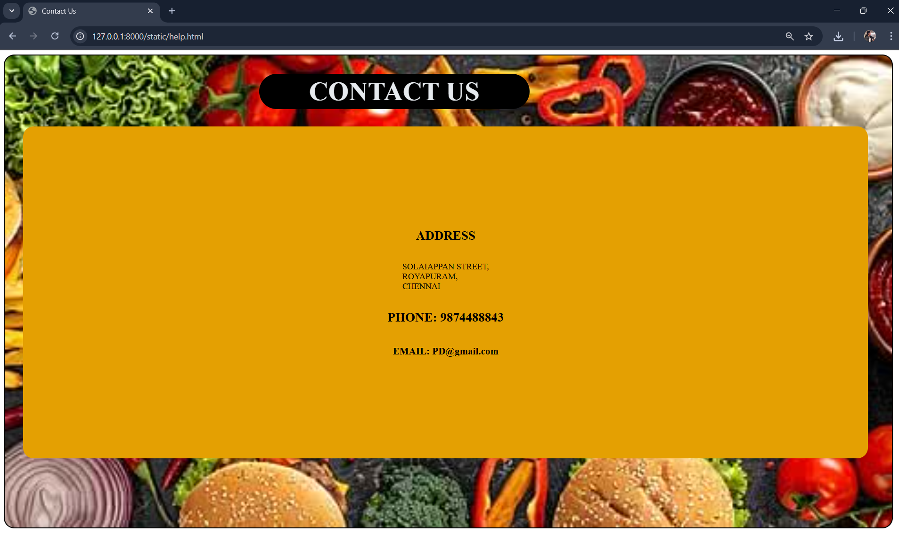

# Ex.07 Restuarant Website
## Date: 16-11-2025
## NAME: PRIYADARSHINI K
## REG NO: 212224100046

## AIM:
To develop a static Resturant website to display the menu and services provided by the resturant.

## DESIGN STEPS:

### Step 1:
Requirement collection.

### Step 2:
Creating the layout using HTML and CSS.

### Step 3:
Updating the sample content.

### Step 4:
Choose the appropriate style and color scheme.

### Step 5:
Validate the layout in various browsers.

### Step 6:
Validate the HTML code.

### Step 7:
Publish the website in the given URL.

## PROGRAM:
HOME.HTML
```
<html>
<title>Restaurant Title</title>

<head>
    <style>
        body {
            display: flex;
            justify-content: center;
            align-items: center;
            
        }
    


        .main {
            width: 99%;
            height: 99%;
            background-color: bisque;
            justify-content: center;
            border: 2px solid black;
            border-radius: 20px;
            background-image: url("back.png");
            background-repeat: no-repeat;
            background-size: cover;
        }

        .main h1 {
            width: 500px;
            position: relative;
            top: 1px;
            left: 480px;
            border-radius: 100px;
            padding: 5px;
            background-color: black;
            color: white;
            font-family: 'Times New Roman', Times, serif;
            font-size: 50px;
        }

        .home {
            background-color: rgb(4, 4, 19);
            color: aliceblue;
            border: 2px solid black;
            border-radius: 50px;
            width: 90%;
            position: absolute;
            top: 120px;
            left: 70px;
            display: flex;
            justify-content: space-evenly;
        }

        .h1 {
            margin: 20px;
            padding: 20px;
            font-family: Georgia, 'Times New Roman', Times, serif;
            font-size: x-large;
        }

        .contents {
            display: flex;
            align-items: center;
            flex-direction: row;
            justify-content: space-around;
            width: 91%;
            height: 400px;
            position: relative;
            top: 100px;
            left: 60px;
            background-color: rgb(228, 160, 2);
            border-radius: 70px;
        }

        .box {
            width: 22%;
            height: 90%;
            background-color: #1a237e;
            border-radius: 50px;
            padding: 10px;
            text-align: center;
        }

        h2 {
            color: white;
            background-color: black;
            width: 90%;
            height: 40px;
            border-radius: 80px;
            text-align: center;
            padding-top: 5px;
            margin: auto;
            font-size: 20px;
        }

        .box img {
            width: 90%;
            height: 250px;
            border-radius: 30px;
            margin-top: 15px;
            object-fit: cover;
        }

        .foot {
            border: 2px;
            width: 25%;
            border-radius: 60px;
            background-color: black;
            color: white;
            position: relative;
            bottom: -250px;
            left: 550px;
        }
    </style>
</head>

<body>
    <div class="main">
        <h1 align="center">PD</h1>

        <div class="home">
            <div class="h1"><a href="home.html">Home</a></div>
            <div class="h1"><a href="menu.html">Menu</a></div>
            <div class="h1"><a href="admin.html">Administration</a></div>
            <div class="h1"><a href="help.html">Contact Us</a></div>
        </div>

        <div class="contents">

            <!-- RESERVATION BOX -->
            <div class="box">
                <h2>RESERVATION</h2>
                
            </div>

            <!-- NEW ITEM BOX -->
            <div class="box">
                <h2>NEW ITEM</h2>
                
            </div>

            <!-- DISCOUNTS BOX -->
            <div class="box">
                <h2>DISCOUNTS</h2>
                
            </div>

        </div>

        <div class="foot">
            <h3 align="center">Designed and Developed By PRIYADARSHINI K</h3>
        </div>
    </div>
</body>

</html>
```
MENU.HTML
```
<!DOCTYPE html>
<html>
<head>
    <title>Menu Items</title>

    <style>
        .main {
            width: 99%;
            height: 99%;
            border: 2px solid black;
            border-radius: 20px;
            background-image: url("back.png");
            background-size: cover;
            background-repeat: no-repeat;
            background-position: center;
            padding-bottom: 50px;
        }

        .main h1 {
            width: 500px;
            margin: 20px auto;
            border-radius: 100px;
            padding: 10px;
            background-color: black;
            color: white;
            font-family: 'Times New Roman', Times, serif;
            font-size: 50px;
            text-align: center;
        }

        .row {
            display: flex;
            justify-content: space-around;
            width: 95%;
            margin: auto;
            margin-top: 20px;
        }

        .item {
            width: 20%;
            height: 350px;
            background-color: darkblue;
            border-radius: 30px;
            position: relative;
            overflow: hidden;
            border: 2px solid black;
            text-align: center;
        }

        .item img {
            width: 100%;
            height: 85%;
            object-fit: cover;
            border-radius: 30px 30px 0 0;
        }

        .item h2 {
            background-color: black;
            color: white;
            width: 90%;
            margin: 8px auto;
            padding: 5px;
            border-radius: 30px;
            font-size: 18px;
        }
    </style>

</head>
<body>

    <div class="main">

        <h1>MENU</h1>

        <!-- FIRST ROW -->
        <div class="row">
            <div class="item">
                
                <h2>DOSA</h2>
            </div>

            <div class="item">
                
                <h2>IDLY</h2>
            </div>

            <div class="item">
                
                <h2>SAMBAR BONDA</h2>
            </div>

            <div class="item">
                
                <h2>PAROTA</h2>
            </div>

            <div class="item">
                
                <h2>PONGAL</h2>
            </div>
        </div>

        <!-- SECOND ROW -->
        <div class="row">

            <div class="item">
                
                <h2>CHAPATHI</h2>
            </div>

            <div class="item">
                
                <h2>IDIYAPPAM</h2>
            </div>

            <div class="item">
                
                <h2>ONION DOSA</h2>
            </div>

            <div class="item">
                
                <h2>KARA PANIYARAM</h2>
            </div>

        </div>

    </div>

</body>
</html>
```
ADMIN.HTML
```
<html>
<head>
<title>Administration</title>

<style>
    .main {
        width: 99%;
        min-height: 99vh;
        border: 2px solid black;
        border-radius: 20px;
        background-image: url("back.png");
        background-size: cover;
        background-repeat: no-repeat;
        padding-bottom: 50px;
    }

    .main h1 {
        width: 500px;
        margin: 20px auto;
        padding: 10px;
        background: black;
        color: white;
        border-radius: 100px;
        text-align: center;
        font-size: 45px;
        font-family: 'Times New Roman';
    }

    
    .row {
        display: flex;
        justify-content: space-around;
        width: 90%;
        margin: 40px auto;
    }

    
    .card {
        width: 22%;
        height: 350px;
        background: white;
        border-radius: 35px;
        overflow: hidden;
        border: 3px solid rgb(40, 40, 120);
        position: relative;
        box-shadow: 0px 5px 20px rgba(0,0,0,0.4);
    }

    
    .card img {
        width: 100%;
        height: 75%;
        object-fit: cover;
    }

    
    .name {
        position: absolute;
        top: 10px;
        left: 50%;
        transform: translateX(-50%);
        width: 80%;
        padding: 6px;
        text-align: center;
        font-weight: bold;
        background: black;
        color: white;
        border-radius: 40px;
        font-size: 18px;
    }

    
    .role {
        position: absolute;
        bottom: 15px;
        left: 50%;
        transform: translateX(-50%);
        width: 80%;
        padding: 6px;
        text-align: center;
        font-weight: bold;
        background: black;
        color: white;
        border-radius: 8px;
        font-size: 16px;
    }
</style>
</head>

<body>

<div class="main">

    <h1>ADMINISTRATOR</h1>

    
    <div class="row">

        <div class="card">
            <div class="name">PRIYA</div>
            
            <div class="role">MANAGER</div>
        </div>

        <div class="card">
            <div class="name">RABI</div>
            
            <div class="role">ASST. MANAGER</div>
        </div>

        <div class="card">
            <div class="name">AKASH</div>
            
            <div class="role">CHEF</div>
        </div>

    </div>

    
    <div class="row">

        <div class="card">
            <div class="name">RAJASHREE</div>
            
            <div class="role">CASHIER</div>
        </div>

        <div class="card">
            <div class="name">DARSHAN</div>
            
            <div class="role">WAITER</div>
        </div>

        <div class="card">
            <div class="name">VISVES</div>
            
            <div class="role">SERVANT</div>
        </div>

    </div>

</div>

</body>
</html>
```
HELP.HTML
```
<html>
    <title>Contact Us</title>
    <head>
        <style>
            .main{
                width: 99%;
                height: 99%;
                background-color: bisque;
                justify-content: center;
                border: 2px solid black;
                border-radius: 20px;
                background-image: url("back.png");
                background-repeat: no-repeat;
                background-size: cover;
            }
            .main h1{
                width: 500px;
                position: relative;
                top: 1px;
                left: 480px;
                border: 1px;
                border-radius: 100px;
                padding: 5px;
                background-color: black;
                color:rgb(230, 234, 238);
                
                font-family: 'Times New Roman', Times, serif;
                font-size:  50px;
            }
            .det{
                display: flex;
                flex-direction: column;
                align-items: center;
                justify-content: center;
                position: relative;
                left: 35px;
                width: 95%;
                height: 70%;
                border: 2px solid rgb(228, 160, 2);
                border-radius: 20px;
                background-color: rgb(228, 160, 2);
            }
        </style>
    </head>
    <body>
        <div class="main">
            <h1 align="center">CONTACT US</h1>
            <div class="det">
                <h2 align="center">ADDRESS</h2>
                <p>SOLAIAPPAN STREET,<BR>
                    ROYAPURAM,<br>
                    CHENNAI
                </p>
                <h2 align="center"> PHONE: 9874488843</h2>
                <h3>EMAIL: PD@gmail.com</h3>
            </div>
        </div>
    </body>
</html>
```


## OUTPUT:






## RESULT:
The program for designing software company website using HTML and CSS is completed successfully.
